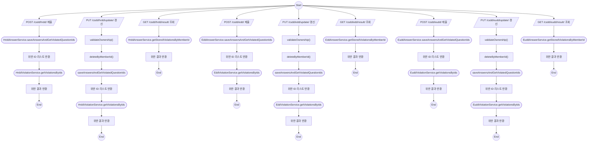

```mermaid
flowchart TD
  start((Start))

  %% HRDD 흐름
  start --> HRDD_Post[/POST /csdd/hrdd/ 제출/]
  HRDD_Post --> HRDD_Save(["HrddAnswerService.saveAnswersAndGetViolatedQuestionIds"])
  HRDD_Save --> HRDD_IDs["위반 ID 리스트 반환"]
  HRDD_IDs --> HRDD_Violations(["HrddViolationService.getViolationsByIds"])
  HRDD_Violations --> HRDD_Result["위반 결과 반환"]
  HRDD_Result --> end1((End))

  start --> HRDD_Put[/PUT /csdd/hrdd/update/ 갱신/]
  HRDD_Put --> HRDD_Valid["validateOwnership()"]
  HRDD_Valid --> HRDD_Delete["deleteByMemberId()"]
  HRDD_Delete --> HRDD_SavePut(["saveAnswersAndGetViolatedQuestionIds"])
  HRDD_SavePut --> HRDD_IDsPut["위반 ID 리스트 반환"]
  HRDD_IDsPut --> HRDD_ViolationsPut(["HrddViolationService.getViolationsByIds"])
  HRDD_ViolationsPut --> HRDD_ResultPut["위반 결과 반환"]
  HRDD_ResultPut --> end2((End))

  start --> HRDD_Get[/GET /csdd/hrdd/result/ 조회/]
  HRDD_Get --> HRDD_Stored(["HrddAnswerService.getStoredViolationsByMemberId"])
  HRDD_Stored --> HRDD_ResultGet["위반 결과 반환"]
  HRDD_ResultGet --> end3((End))

  %% EDD 흐름
  start --> EDD_Post[/POST /csdd/edd/ 제출/]
  EDD_Post --> EDD_Save(["EddAnswerService.saveAnswersAndGetViolatedQuestionIds"])
  EDD_Save --> EDD_IDs["위반 ID 리스트 반환"]
  EDD_IDs --> EDD_Violations(["EddViolationService.getViolationsByIds"])
  EDD_Violations --> EDD_Result["위반 결과 반환"]
  EDD_Result --> end4((End))

  start --> EDD_Put[/PUT /csdd/edd/update/ 갱신/]
  EDD_Put --> EDD_Valid["validateOwnership()"]
  EDD_Valid --> EDD_Delete["deleteByMemberId()"]
  EDD_Delete --> EDD_SavePut(["saveAnswersAndGetViolatedQuestionIds"])
  EDD_SavePut --> EDD_IDsPut["위반 ID 리스트 반환"]
  EDD_IDsPut --> EDD_ViolationsPut(["EddViolationService.getViolationsByIds"])
  EDD_ViolationsPut --> EDD_ResultPut["위반 결과 반환"]
  EDD_ResultPut --> end5((End))

  start --> EDD_Get[/GET /csdd/edd/result/ 조회/]
  EDD_Get --> EDD_Stored(["EddAnswerService.getStoredViolationsByMemberId"])
  EDD_Stored --> EDD_ResultGet["위반 결과 반환"]
  EDD_ResultGet --> end6((End))

  %% EUDD 흐름
  start --> EUDD_Post[/POST /csdd/eudd/ 제출/]
  EUDD_Post --> EUDD_Save(["EuddAnswerService.saveAnswersAndGetViolatedQuestionIds"])
  EUDD_Save --> EUDD_IDs["위반 ID 리스트 반환"]
  EUDD_IDs --> EUDD_Violations(["EuddViolationService.getViolationsByIds"])
  EUDD_Violations --> EUDD_Result["위반 결과 반환"]
  EUDD_Result --> end7((End))

  start --> EUDD_Put[/PUT /csdd/eudd/update/ 갱신/]
  EUDD_Put --> EUDD_Valid["validateOwnership()"]
  EUDD_Valid --> EUDD_Delete["deleteByMemberId()"]
  EUDD_Delete --> EUDD_SavePut(["saveAnswersAndGetViolatedQuestionIds"])
  EUDD_SavePut --> EUDD_IDsPut["위반 ID 리스트 반환"]
  EUDD_IDsPut --> EUDD_ViolationsPut(["EuddViolationService.getViolationsByIds"])
  EUDD_ViolationsPut --> EUDD_ResultPut["위반 결과 반환"]
  EUDD_ResultPut --> end8((End))

  start --> EUDD_Get[/GET /csdd/eudd/result/ 조회/]
  EUDD_Get --> EUDD_Stored(["EuddAnswerService.getStoredViolationsByMemberId"])
  EUDD_Stored --> EUDD_ResultGet["위반 결과 반환"]
  EUDD_ResultGet --> end9((End))
```