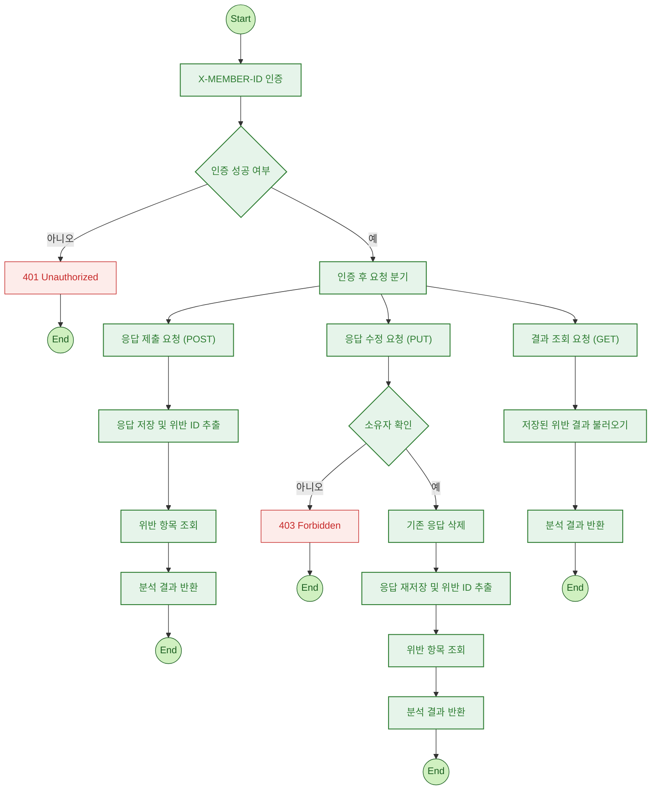

```mermaid
flowchart TD

%% ───── 공통: 인증 블록 ─────
    Start((Start))
    Start --> Auth["X-MEMBER-ID 인증"]
    Auth --> AuthCheck{"인증 성공 여부"}
    AuthCheck -- "아니오" --> Error401["401 Unauthorized"] --> End1((End))
    AuthCheck -- "예" --> Router["인증 후 요청 분기"]

%% ───── 응답 제출 흐름 ─────
    Router --> PostReq["응답 제출 요청 (POST)"]
    PostReq --> SaveAns["응답 저장 및 위반 ID 추출"]
    SaveAns --> FindViol["위반 항목 조회"]
    FindViol --> PostResp["분석 결과 반환"]
    PostResp --> End2((End))

%% ───── 응답 수정 흐름 ─────
    Router --> PutReq["응답 수정 요청 (PUT)"]
    PutReq --> CheckOwner{"소유자 확인"}
    CheckOwner -- "아니오" --> Error403["403 Forbidden"] --> End3((End))
    CheckOwner -- "예" --> DeleteOld["기존 응답 삭제"]
    DeleteOld --> SaveNew["응답 재저장 및 위반 ID 추출"]
    SaveNew --> FindViol2["위반 항목 조회"]
    FindViol2 --> PutResp["분석 결과 반환"]
    PutResp --> End4((End))

%% ───── 결과 조회 흐름 ─────
    Router --> GetReq["결과 조회 요청 (GET)"]
    GetReq --> LoadStored["저장된 위반 결과 불러오기"]
    LoadStored --> GetResp["분석 결과 반환"]
    GetResp --> End5((End))

%% ───── 스타일 정의 ─────
    classDef forest fill:#e6f4ea,stroke:#2e7d32,stroke-width:1.5px,color:#2e7d32;
    classDef terminal fill:#d0f0c0,stroke:#1b5e20,color:#1b5e20;
    classDef error fill:#fdecea,stroke:#c62828,color:#c62828;

%% ───── 클래스 적용 ─────
    class Start,End1,End2,End3,End4,End5 terminal;
    class Auth,AuthCheck,Router,PostReq,SaveAns,FindViol,PostResp,PutReq,CheckOwner,DeleteOld,SaveNew,FindViol2,PutResp,GetReq,LoadStored,GetResp forest;
    class Error401,Error403 error;
```
